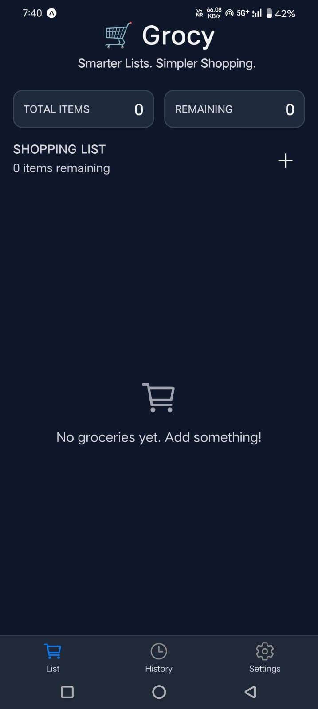
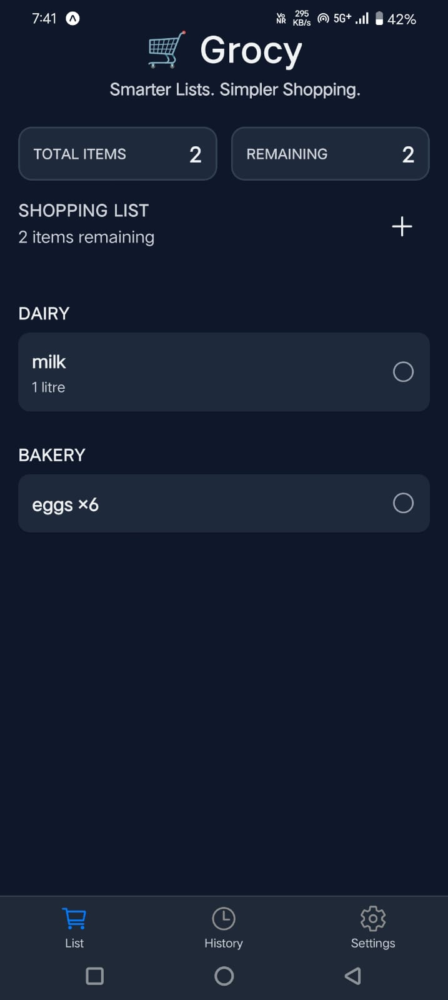
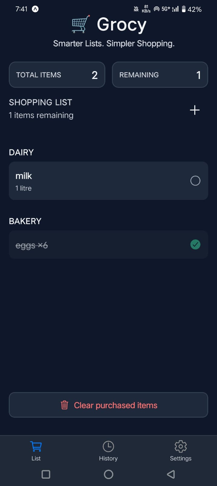
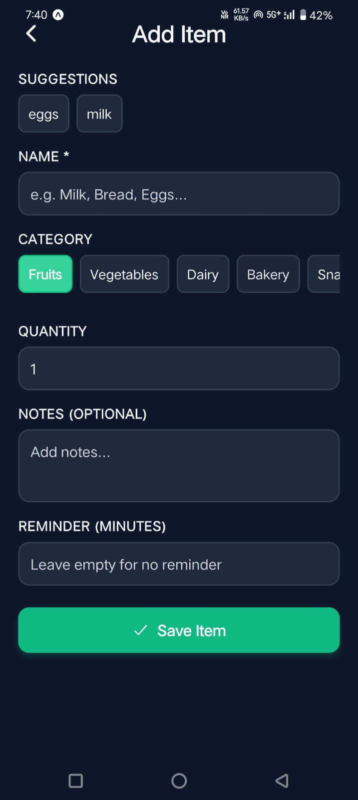
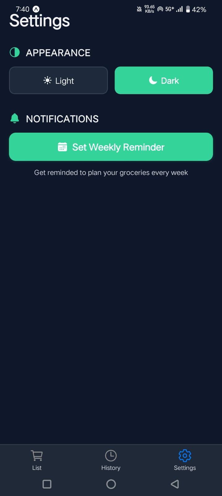

🛒 Grocy

Smarter Lists. Simpler Shopping.

Grocy is a modern grocery planning and shopping assistant built using React Native and Expo. It helps users organize grocery items, track what needs to be purchased, revisit past items, set reminders, and personalize the experience with light/dark themes all while storing data locally on the device.

Grocy makes grocery shopping effortless, intelligent, and enjoyable.

✨ Features

📝 Add Grocery Items

Add items with a name, category, quantity, and optional notes

User-friendly input flow with validation

Categories help in quick organization

📋 Smart Shopping List

Displays groceries grouped by category

Check items off when purchased

Undo purchase anytime

Shows how many items remain to be bought

🕓 Shopping History

Keeps track of previously purchased items

Quickly add items back to the current list

💾 Local Persistence

Uses Async Storage + Zustand for offline data storage

Data remains even after app restarts

🔔 Notifications

Set reminders for individual items

Optional weekly grocery reminder

Helps users never miss essential purchases

🎨 Theme Support

Light & Dark themes with smooth transitions

Preferences persist across sessions

🛠️ Tech Stack

Framework-	React Native + Expo

Navigation-	Expo Router

State Management-	Zustand

Storage-	Async Storage

Notifications-	Expo Notifications

Icons- Ionicons

📂 Project Structure

app/

  _layout.tsx             → Root layout & theme system

  add-item.tsx            → Add item screen

  (tabs)/

    _layout.tsx           → Tab navigation

    index.tsx             → Shopping List screen

    history.tsx           → History of purchased items

    settings.tsx          → Theme & reminder settings

src/

  store/useGroceryStore.js → Zustand store + persistence

  utils/notifications.js    → Reminder utilities

  theme/colors.ts           → Design system colors

assets/

screenshots/               → Images for README

🚀 Installation & Setup

1️⃣ Clone the repository

    git clone https://github.com/samri-dddhi/Grocy.git

    cd grocy

2️⃣ Install dependencies

    npm install

    # or

    bun install

3️⃣ Launch the app

    npx expo start

Open the app in:

Expo Go (Android), or

A development build for notifications

##  📸Screenshots
### 🏠 Home Screen

### 🛒 Shopping List

### ✔ Remaining Items Counter

### ➕ Add Item

### 📚 Purchase History

### ⚙ Settings (Theme & Reminders)

🎯 Why Grocy?

Most grocery apps are cluttered or too complex. Grocy focuses on:

✔ simplicity

✔ smart organization

✔ persistence and reminders

✔ clean UI with theme options

It helps users track groceries, avoid forgotten purchases, and quickly reuse previous lists.

🏁 Conclusion

Grocy demonstrates practical mobile app development with:

real local storage

functional UI/UX patterns

navigation, reminders, and theme support

It is a complete, working, and user-friendly grocery management solution.

👨‍💻 Developer

Samriddhi Srivastava